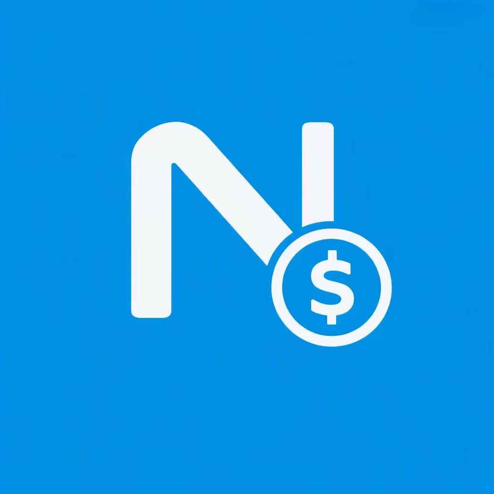
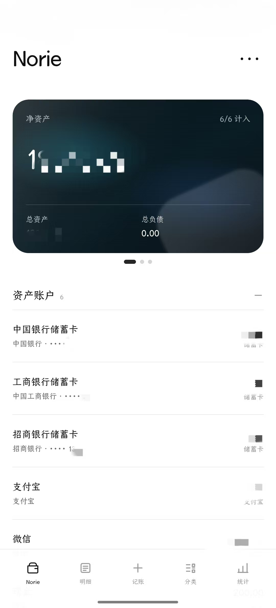
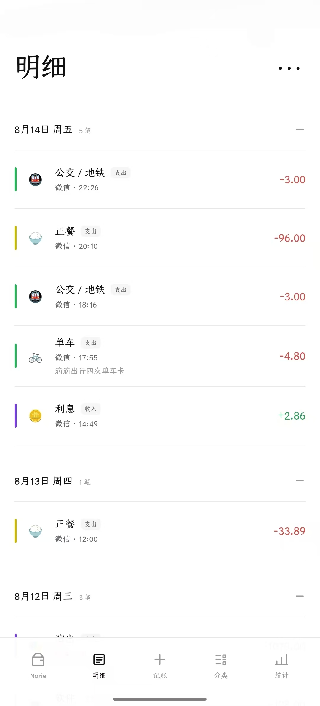
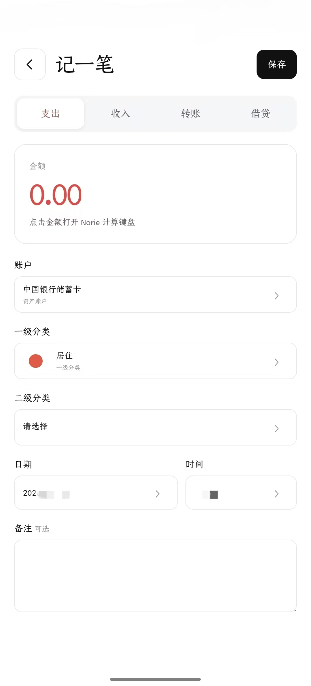
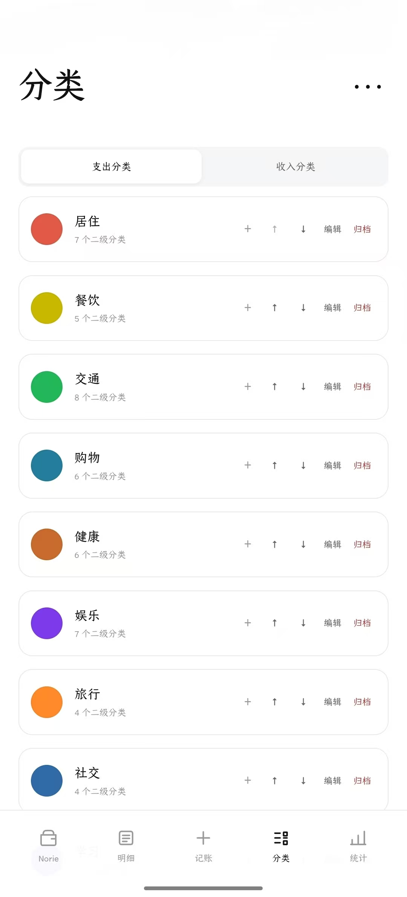
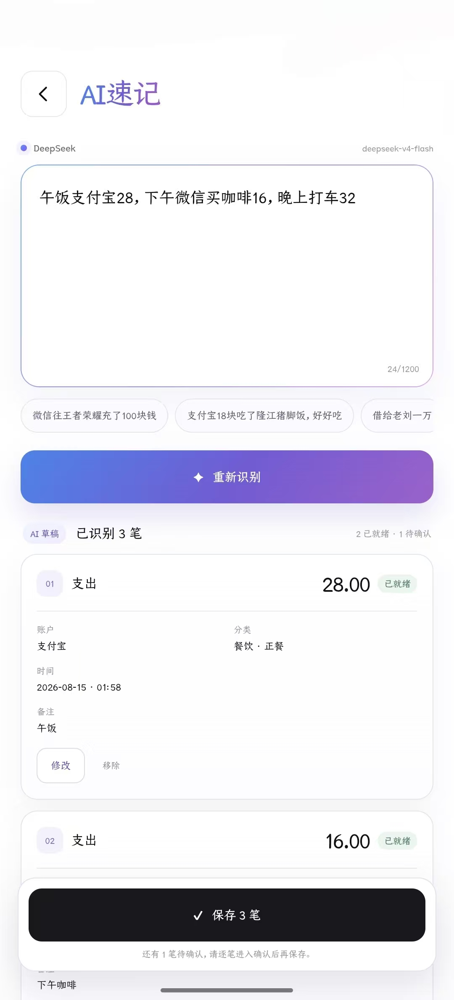
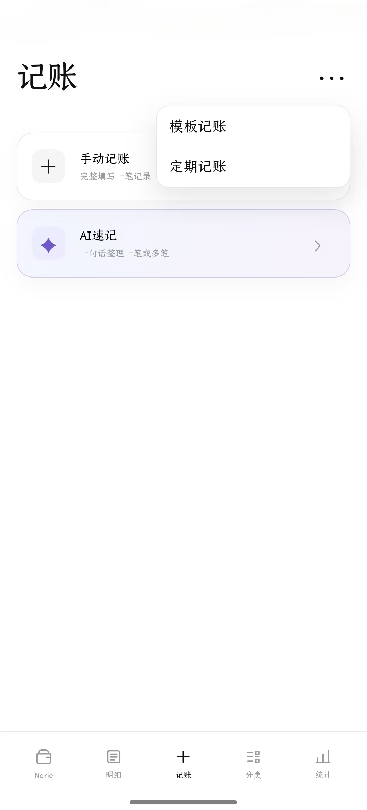
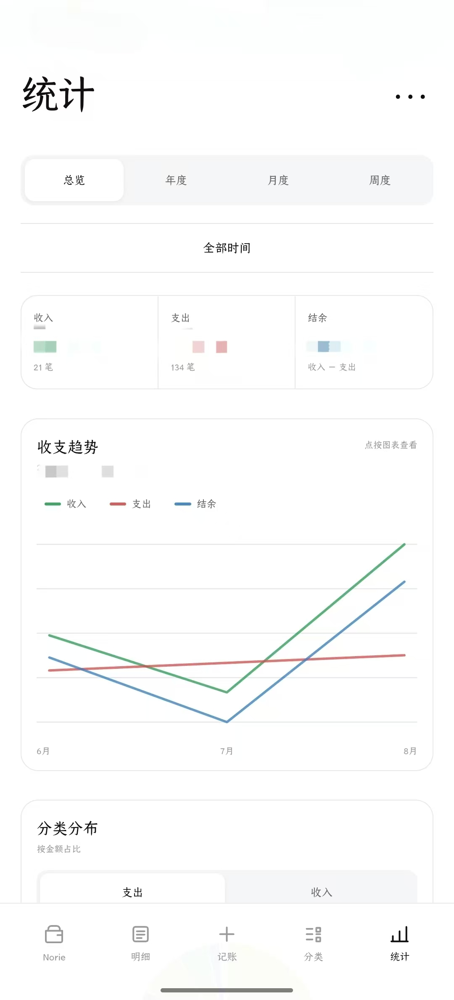
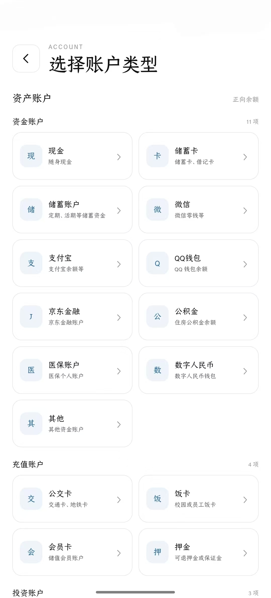

<p align="center">
  
</p>

<h1 align="center">Norie</h1>

<p align="center"><strong>安静地记好每一笔。</strong></p>

<p align="center">A quiet, local-first personal bookkeeping app for Android. Your data stays yours.</p>

---

## 关于 Norie

Norie 是一个本地优先的 Android 个人记账应用，面向希望长期掌握自己账本数据的人。

它不要求注册 Norie 账号，也不依赖 Norie 云端保存账本。正式账本保存在设备本地 SQLite 数据库中，并提供数据导入、导出与迁移能力。

### app截图

|  |  |  |  |
|----------------------|----------------------|----------------------|----------------------|
|  |  |  |  |


### 主要功能

- 账户、资产、负债与净资产管理
- 支出、收入、转账、借贷与退款
- 两级分类与可自定义分类配色
- 明细筛选与分类统计
- 模板记账与定期记账提醒
- AI 速记：把自然语言整理成一笔或多笔可确认的记账草稿
- 本地数据 ZIP 导入 / 导出
- 归档账户与归档分类管理
- Android 本地优先运行

## 数据原则

Norie 的核心原则是：

> 你的账本属于你自己。

- 账本数据默认保存在手机本地。
- Norie 不提供云账号，也不运行云端账本服务。
- Norie 不集成广告 SDK 或行为分析 SDK。
- AI 功能只有在用户主动使用并配置模型 API 后才会联网。
- AI 负责理解和整理，本地代码负责校验与写入账本。

详细说明请阅读 [PRIVACY.md](./PRIVACY.md)。

## 下载

请只从本仓库的 **GitHub Releases** 下载官方 APK：

**https://github.com/brankohuang/norie/releases**

安装和版本验证方法见 [DOWNLOAD.md](./DOWNLOAD.md) 与 [VERIFY.md](./VERIFY.md)。

> Norie 当前免费发布，但不是开源软件。本仓库仅提供官方文档与正式构建版本，不提供应用源代码。

## 官方身份

- 应用名称：**Norie**
- 开发者：**Branko**
- GitHub：[@brankohuang](https://github.com/brankohuang)
- 官方仓库：`brankohuang/norie`
- Android Application ID：`io.github.brankohuang.norie`
- 官方签名证书 SHA-256：

```text
69:FF:B6:3C:1A:09:7F:42:85:5E:53:DE:CA:60:3B:3F:B3:ED:89:95:0E:40:0E:73:D0:62:EC:BA:24:D3:7E:7A
```

## 关于第三方分发

Norie 通过本 GitHub 仓库免费发布。

欢迎分享本仓库或 GitHub Release 链接，但请不要购买来源不明的 Norie 安装包，也不要将第三方重新包装、修改或收费销售的版本视为官方版本。

如果你从其他地方获得 Norie，可以在应用内进入：

```text
设置 → 关于 Norie → 官方项目主页
```

核对官方仓库。

## 反馈

如果发现 Bug 或有功能建议，可以使用本仓库的 GitHub Issues。

提交问题时请不要上传真实账单 ZIP、API Key、银行卡信息、完整账户数据或其他个人敏感内容。

## 当前公开版本

首次公开发布建议从 **v0.23.3** 开始。

版本变化见 [CHANGELOG.md](./CHANGELOG.md)。

---

© 2026 Branko. All rights reserved.
